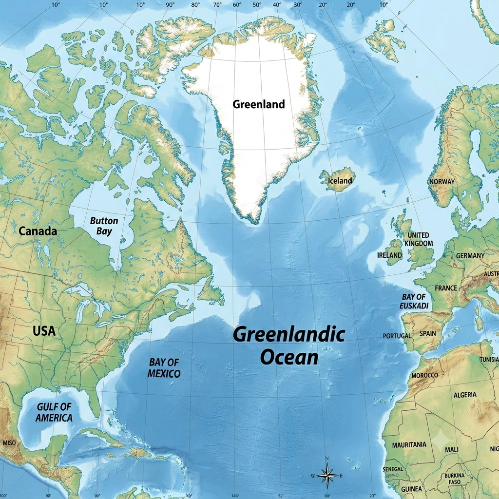

# Next Tab Group

[](https://github.com/notuntoward/next-tab-group/actions/workflows/build.yml)
[](https://github.com/notuntoward/next-tab-group/actions/workflows/codeql.yml)
[](https://github.com/notuntoward/next-tab-group/actions/workflows/scorecard.yml)
[](https://securityscorecards.dev/viewer/?uri=github.com/notuntoward/next-tab-group)

This plugin provides commands for efficient tab group navigation and workspace manipulation in Obsidian, inspired by Emacs window commands. Note the [Quick Explorer Plugin Side Effect](#quick-explorer-plugin-side-effect).

# Commands

## Next

**Command ID:** `next`

Cycles your cursor between “tab groups”: whole windows with individual tabs inside. The cycling is similar to the Emacs `other-window` command:

1. Top to bottom  
2. Left to right (within each row)

**Two tab groups side-by-side**:
```
┌───────────┬───────────┐
│  Group 1  │  Group 2  │
└───────────┴───────────┘
```

Pressing the Next command: Group 1 -> Group 2 -> Group 1 -> ...

**Four tab groups in a 2×2 grid**:
```
┌──────────┬──────────┐
│  Top L   │  Top R   │
├──────────┼──────────┤
│  Bot L   │  Bot R   │
└──────────┴──────────┘
```

Order: Top L -> Top R -> Bot L -> Bot R -> Top L -> ...

The command remembers which tab was active in each group, so switching between groups restores your previous position.

## Collect Tabs

**Command ID:** `collect-tabs`

Gathers **all tabs from all other tab groups** into the currently active tab group, then closes all the now-empty tab groups. This is similar to the Emacs `delete-other-windows` command.

**Before**:
```
┌─────────┬─────────────┬───────────┐
│ A.md    │ X.md        │ W.md      │
│ B.md    │ Y.md        │           │
└─────────┴─────────────┴───────────┘
```

**After**:
```
┌─────────────────────────────────────┐
│ A.md  B.md  X.md  Y.md  W.md        │
└─────────────────────────────────────┘
```

All files remain open; the layout is simplified into a single focused group. Your cursor stays on the tab you started with.

## Rotate Tab Groups

**Command ID:** `rotate-tab-groups`

Performs a recursive **90° Clockwise Rotation** of the entire workspace layout. This behavior is *inspired by* Emacs’s `rotate-frame-clockwise` (from the `transpose-frame` package).

**Side-by-side panes become stacked** (with the right pane moving to the bottom).
```text
    Before (Side-by-Side)             After (Stacked)
┌─────────────┬─────────────┐      ┌─────────────┐
│             │             │      │      B      │
│      A      │      B      │  ->  ├─────────────┤
│             │             │      │      A      │
└─────────────┴─────────────┘      └─────────────┘
```

<div style="display: flex; justify-content: center; gap: 1rem;">
  <figure style="margin: 0; text-align: center;">
    
    <figcaption>Greenlandic Ocean</figcaption>
  </figure>
</div>

<br>


**More complex screen before:**
```text
┌─────────────┬─────────────┐
│             │      B      │
│      A      │             │
│             ├─────────────┤
│             │      C      │
└─────────────┴─────────────┘
```

**More complex screen After:**
```text
┌─────────────┬─────────────┐
│      B      │      C      │
│             │             │
├─────────────┴─────────────┤
│                           │
│             A             │
│                           │
└───────────────────────────┘
```

## Deduplicate Tabs in Group

**Command ID:** `dedupe-tabs-in-group`

Removes duplicate tabs in the **current tab group** that point to the same file. For each duplicated file, the tab that survives is chosen in this order:

1. The currently active tab (if it points to that file).
2. The most recently visited tab in the current tab group (if recency is available).
3. A stable fallback by leaf id.

This command runs without confirmation by default. Enable confirmation in **Settings → Next Tab Group → Confirm before deduplicating in group** to show a dialog listing the tabs to be closed before running it.

## Deduplicate Tabs in All Groups

**Command ID:** `dedupe-tabs-in-all-groups`

Scans **every tab group in the current window** and removes duplicate tabs that point to the same file, leaving at most one tab per note across the window. For each duplicated file, the surviving tab is chosen in this order:

1. The currently active tab.
2. The most recently visited tab in the current tab group.
3. The most recently visited tab in any other group in the current window.
4. A stable fallback by leaf id.

This command shows a confirmation dialog by default, listing every tab it will close (grouped by note, with counts per tab group). Disable the confirmation in **Settings → Next Tab Group → Confirm before deduplicating in all groups**.

## Deduplicate Tabs in All Windows

**Command ID:** `dedupe-tabs-in-all-windows`

Scans **every tab in every window** (the main window and any pop-out windows) and removes duplicate tabs that point to the same file, leaving at most one tab per note across the entire workspace. The surviving tab is chosen in this order:

1. The currently active tab.
2. The most recently visited tab in the active tab group.
3. The most recently visited tab in any other group in the active window.
4. The most recently visited tab in any other window.
5. A stable fallback by leaf id.

This command shows a confirmation dialog by default, listing every tab it will close (grouped by note, with counts per tab group). Disable the confirmation in **Settings → Next Tab Group → Confirm before deduplicating in all windows**.

### What counts as a "duplicate"?

Two tabs count as duplicates when they point to the same file in your vault. Tabs that aren't backed by a file (e.g. the graph view, settings, the daily note calendar) are ignored and never considered duplicates.

### What if a tab's recency is unknown?

The plugin tracks recency by listening for `active-leaf-change` events. After a vault restart, plugin reload, or the first time you run a dedupe command, recency may be unavailable for some tabs. In that case, a stable tie-break by leaf id is used so the result is deterministic.
# Quick Explorer Plugin Side Effect

Rotating tab groups forces a workspace rebuild, which may cause Quick Explorer to duplicate its status bar breadcrumbs along the bottom of the screen. This is because Quick Explorer reacts to the rapid recreation of tabs.

Recommended workaround: hide Quick Explorer's status bar breadcrumbs. Quick Explorer can show breadcrumbs in Obsidian's tab title bars on recent Obsidian versions, so disabling the status bar breadcrumbs avoids the duplicated bottom-bar elements without changing this plugin's behavior.

To apply the workaround:

1. Install or enable the Style Settings community plugin.
2. Open **Settings → Style Settings → Quick Explorer**.
3. Disable Quick Explorer's default/status bar breadcrumbs.
4. Keep Quick Explorer's tab title bar breadcrumbs enabled if you still want breadcrumb navigation.

If the status bar is already cluttered, reload the Quick Explorer plugin or restart Obsidian once after changing the setting.

# Setting Hotkeys

1. Go to **Settings -> Hotkeys** in Obsidian.
2. Search for:
   - `Next`
   - `Collect tabs`
   - `Rotate tab groups`
   - `Deduplicate tabs in group`
   - `Deduplicate tabs in all groups`
   - `Deduplicate tabs in all windows`
3. Assign your preferred shortcuts (e.g., `Cmd+K` sequences or Function keys).
